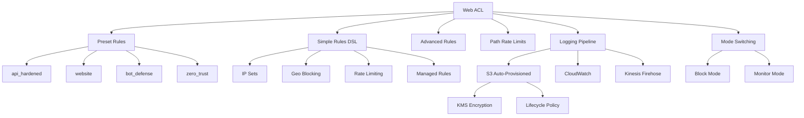

# AWS WAFv2 Terraform Module

A production-ready Terraform module for AWS WAF (Web Application Firewall) v2 with enterprise features, simplified DSL, presets, and auto-provisioned logging.

This module follows the structure, conventions, and best practices used by the [terraform-aws-modules](https://github.com/terraform-aws-modules) organization and is designed for Terraform Registry publishing.

## Architecture



## Features

### Core Features
- **Simple Rules DSL** - Write rules in 3 lines instead of 30
- **Presets** - Production-ready configurations (api_hardened, website, bot_defense, zero_trust)
- **Monitor Mode** - Test rules without blocking traffic
- **Path Rate Limits** - Protect specific endpoints with custom rate limits
- **Auto S3 Logging** - Complete logging pipeline with one flag
- **Self-Referencing** - Reference module-created resources without circular dependencies

### WAF Features
- **Web ACL** - Customizable default action (allow/block)
- **Managed Rule Groups** - AWS Managed Rules with rule action overrides
- **Custom Rule Groups** - Full support for byte match, regex, IP set, geo, rate-based rules
- **IP Sets** - IPv4 and IPv6 with optional `ip_set_key` for self-referencing
- **Regex Pattern Sets** - With optional `regex_pattern_set_key` for self-referencing
- **Rate-based Rules** - IP-based rate limiting with scope-down support
- **Geo-blocking** - Country-based allow/block with forwarded IP config
- **Statement Nesting** - AND, OR, NOT statement combinations
- **Actions** - Allow, block, count, CAPTCHA, challenge
- **Associations** - ALB, API Gateway, AppSync, CloudFront

### Enterprise Features
- **KMS Encryption** - Automatic KMS key creation for log encryption
- **Lifecycle Management** - Automatic log expiration policies
- **IAM Automation** - Auto-created roles and policies for Firehose
- **Public Access Block** - S3 buckets secured by default
- **Monitoring** - CloudWatch metrics for all rules

## Usage

### Quick Start with Simple Rules DSL

```hcl
module "waf" {
  source = "terraform-aws-modules/waf/aws"

  name  = "my-waf"
  scope = "REGIONAL"

  simple_rules = [
    {
      name          = "BlockBadCountries"
      priority      = 1
      country_codes = ["CN", "RU"]
    },
    {
      name       = "RateLimit"
      priority   = 2
      rate_limit = 2000
    },
    {
      name               = "AWSManagedCommon"
      priority           = 3
      managed_rule_group = "AWSManagedRulesCommonRuleSet"
    }
  ]
}
```

### Using Presets

```hcl
module "waf" {
  source = "terraform-aws-modules/waf/aws"

  name   = "my-api-waf"
  preset = "api_hardened"
  
  enable_logging = true
  logging_mode   = "s3"
}
```

### Monitor Mode (Test Without Blocking)

```hcl
module "waf" {
  source = "terraform-aws-modules/waf/aws"

  name = "my-waf"
  mode = "monitor"  # All block actions become count
  
  simple_rules = [
    {
      name          = "TestGeoBlock"
      priority      = 1
      country_codes = ["CN"]
    }
  ]
}
```

### Minimal Example

```hcl
module "waf" {
  source = "terraform-aws-modules/waf/aws"
  # source = "../.."  # For local development

  name        = "my-web-acl"
  description = "Minimal Web ACL"
  scope       = "REGIONAL"

  default_action = "allow"

  rules = [
    {
      name     = "AWSManagedRulesCommonRuleSet"
      priority = 1

      statement = {
        managed_rule_group_statement = {
          name        = "AWSManagedRulesCommonRuleSet"
          vendor_name = "AWS"
        }
      }

      override_action = "none"

      visibility_config = {
        cloudwatch_metrics_enabled = true
        metric_name                = "CommonRuleSetMetric"
        sampled_requests_enabled   = true
      }
    }
  ]

  visibility_config = {
    metric_name = "my-web-acl-metric"
  }

  tags = {
    Environment = "production"
  }
}
```

### Referencing Module-Created Resources

Use `ip_set_key`, `rule_group_key`, or `regex_pattern_set_key` to reference resources created by the same module (avoids circular dependencies):

```hcl
module "waf" {
  source = "../.."

  name  = "my-waf"
  scope = "REGIONAL"

  ip_sets = {
    blocked_ips = {
      ip_address_version = "IPV4"
      addresses          = ["192.0.2.0/24"]
    }
  }

  rules = [
    {
      name     = "BlockIPs"
      priority = 1
      action   = "block"

      statement = {
        ip_set_reference_statement = {
          ip_set_key = "blocked_ips"  # References module-created IP set
        }
      }

      visibility_config = {
        metric_name = "BlockIPsMetric"
      }
    }
  ]
}
```

### CloudFront

```hcl
module "waf_cloudfront" {
  source = "../.."

  name  = "cloudfront-waf"
  scope = "CLOUDFRONT"

  rules = [
    {
      name     = "AWSManagedRulesCommonRuleSet"
      priority = 1

      statement = {
        managed_rule_group_statement = {
          name        = "AWSManagedRulesCommonRuleSet"
          vendor_name = "AWS"
        }
      }

      override_action = "none"

      visibility_config = {
        metric_name = "CommonRuleSetMetric"
      }
    }
  ]
}

# Associate with CloudFront
resource "aws_cloudfront_distribution" "main" {
  # ...
  web_acl_id = module.waf_cloudfront.web_acl_arn
}
```

### Application Load Balancer

```hcl
module "waf_alb" {
  source = "../.."

  name  = "alb-waf"
  scope = "REGIONAL"

  ip_sets = {
    blocked_ips = {
      ip_address_version = "IPV4"
      addresses          = ["192.0.2.0/24"]
    }
  }

  rules = [
    {
      name     = "BlockIPSet"
      priority = 1
      action   = "block"

      statement = {
        ip_set_reference_statement = {
          ip_set_key = "blocked_ips"
        }
      }

      visibility_config = {
        metric_name = "BlockIPSetMetric"
      }
    },
    {
      name     = "RateLimitRule"
      priority = 2
      action   = "block"

      statement = {
        rate_based_statement = {
          limit              = 2000
          aggregate_key_type = "IP"
        }
      }

      visibility_config = {
        metric_name = "RateLimitMetric"
      }
    }
  ]

  resource_arns = [aws_lb.main.arn]
}
```

### API Gateway

```hcl
module "waf_apigw" {
  source = "../.."

  name  = "apigw-waf"
  scope = "REGIONAL"

  rules = [
    {
      name     = "GeoBlockRule"
      priority = 1
      action   = "block"

      statement = {
        geo_match_statement = {
          country_codes = ["CN", "RU"]
        }
      }

      visibility_config = {
        metric_name = "GeoBlockMetric"
      }
    },
    {
      name     = "RateLimitRule"
      priority = 2
      action   = "block"

      statement = {
        rate_based_statement = {
          limit              = 2000
          aggregate_key_type = "IP"
        }
      }

      visibility_config = {
        metric_name = "RateLimitMetric"
      }
    }
  ]

  resource_arns = [aws_api_gateway_stage.prod.arn]
}
```

### AppSync

```hcl
module "waf_appsync" {
  source = "../.."

  name  = "appsync-waf"
  scope = "REGIONAL"

  rules = [
    {
      name     = "AWSManagedRulesCommonRuleSet"
      priority = 1

      statement = {
        managed_rule_group_statement = {
          name        = "AWSManagedRulesCommonRuleSet"
          vendor_name = "AWS"
        }
      }

      override_action = "none"

      visibility_config = {
        metric_name = "CommonRuleSetMetric"
      }
    }
  ]

  resource_arns = [aws_appsync_graphql_api.main.arn]
}
```

## Examples

The `examples` directory contains working examples:

| Example | Description |
|---------|-------------|
| [minimal](./examples/minimal) | Minimal Web ACL with one managed rule |
| [simple-rules](./examples/simple-rules) | Simple Rules DSL demonstration |
| [monitor-mode](./examples/monitor-mode) | Monitor mode for testing rules |
| [preset-api-hardened](./examples/preset-api-hardened) | API hardened preset with path rate limits |
| [s3-logging](./examples/s3-logging) | Auto-provisioned S3 logging pipeline |
| [cloudfront](./examples/cloudfront) | CloudFront scope with managed rules |
| [alb](./examples/alb) | ALB with IP sets and rate limiting |
| [apigw](./examples/apigw) | API Gateway with geo-blocking |
| [full](./examples/full) | Comprehensive example with all components |

## Available Presets

### api_hardened
- AWSManagedRulesCommonRuleSet
- AWSManagedRulesKnownBadInputsRuleSet
- Rate limiting (2000 req/5min)

### website
- AWSManagedRulesCommonRuleSet
- AWSManagedRulesAmazonIpReputationList

### bot_defense
- AWSManagedRulesBotControlRuleSet

### zero_trust
- AWSManagedRulesCommonRuleSet
- AWSManagedRulesKnownBadInputsRuleSet
- AWSManagedRulesAmazonIpReputationList
- Strict rate limiting (1000 req/5min)

## Simple Rules DSL

The `simple_rules` variable provides a simplified syntax for common patterns:

```hcl
simple_rules = [
  # Geo blocking
  {
    name          = "BlockCountries"
    priority      = 1
    country_codes = ["CN", "RU"]
  },
  
  # Rate limiting
  {
    name       = "RateLimit"
    priority   = 2
    rate_limit = 2000
  },
  
  # Managed rules
  {
    name               = "AWSManaged"
    priority           = 3
    managed_rule_group = "AWSManagedRulesCommonRuleSet"
  },
  
  # IP set (reference module-created IP set)
  {
    name       = "BlockIPs"
    priority   = 4
    ip_set_key = "blocked_ips"
  }
]
```

## Path Rate Limits

Protect specific endpoints with custom rate limits:

```hcl
path_rate_limits = [
  {
    path  = "/api/login"
    limit = 100
  },
  {
    path  = "/api/register"
    limit = 50
  }
]
```

## Auto S3 Logging

Complete logging pipeline with one flag:

```hcl
enable_logging        = true
logging_mode          = "s3"
log_retention_days    = 30
enable_kms_encryption = true
```

Automatically creates:
- S3 bucket with public access block
- Kinesis Firehose delivery stream
- IAM roles and policies
- KMS key for encryption
- Lifecycle policies

## Mode Switching

Test rules without blocking traffic:

```hcl
mode = "monitor"  # Converts all block actions to count
```

Switch to production:

```hcl
mode = "block"  # Default, enforces all rules
```

### Rule Statement Types

| Type                           | Web ACL | Rule Group |
| ------------------------------ | ------- | ---------- |
| Managed Rule Group             | ✅      | -          |
| Rule Group Reference           | ✅      | -          |
| Rate-based                     | ✅      | ✅         |
| IP Set Reference               | ✅      | ✅         |
| Geo Match                      | ✅      | ✅         |
| Byte Match                     | ✅      | ✅         |
| Regex Match                    | ✅      | ✅         |
| Regex Pattern Set Reference    | ✅      | ✅         |
| Size Constraint                | ✅      | ✅         |
| SQLi Match                     | ✅      | ✅         |
| XSS Match                      | ✅      | ✅         |
| Label Match                    | ✅      | ✅         |
| AND Statement                 | ✅      | -          |
| OR Statement                  | ✅      | -          |
| NOT Statement                 | ✅      | -          |

### Field to Match

- `all_query_arguments`
- `body` (with oversize_handling)
- `json_body` (match_scope, match_pattern, oversize_handling)
- `cookies`
- `method`
- `query_string`
- `single_header`
- `single_query_argument`
- `uri_path`

### Actions

- Allow
- Block (with custom_response_body)
- Count
- CAPTCHA (with custom_response_body)
- Challenge (with custom_response_body)

<!-- BEGIN_TF_DOCS -->
## Requirements

| Name | Version |
|------|---------|
| <a name="requirement_terraform"></a> [terraform](#requirement\_terraform) | >= 1.0 |
| <a name="requirement_aws"></a> [aws](#requirement\_aws) | >= 5.0 |

## Providers

| Name | Version |
|------|---------|
| <a name="provider_aws"></a> [aws](#provider\_aws) | >= 5.0 |

## Resources

| Name | Type |
|------|------|
| [aws_wafv2_ip_set.this](https://registry.terraform.io/providers/hashicorp/aws/latest/docs/resources/wafv2_ip_set) | resource |
| [aws_wafv2_regex_pattern_set.this](https://registry.terraform.io/providers/hashicorp/aws/latest/docs/resources/wafv2_regex_pattern_set) | resource |
| [aws_wafv2_rule_group.this](https://registry.terraform.io/providers/hashicorp/aws/latest/docs/resources/wafv2_rule_group) | resource |
| [aws_wafv2_web_acl.this](https://registry.terraform.io/providers/hashicorp/aws/latest/docs/resources/wafv2_web_acl) | resource |
| [aws_wafv2_web_acl_logging_configuration.this](https://registry.terraform.io/providers/hashicorp/aws/latest/docs/resources/wafv2_web_acl_logging_configuration) | resource |
| [aws_wafv2_web_acl_association.this](https://registry.terraform.io/providers/hashicorp/aws/latest/docs/resources/wafv2_web_acl_association) | resource |

## Inputs

| Name | Description | Type | Default | Required |
|------|-------------|------|---------|:--------:|
| <a name="input_create"></a> [create](#input\_create) | Controls whether WAF resources should be created | `bool` | `true` | no |
| <a name="input_name"></a> [name](#input\_name) | Name of the Web ACL and prefix for child resources | `string` | n/a | yes |
| <a name="input_description"></a> [description](#input\_description) | Description of the Web ACL | `string` | `""` | no |
| <a name="input_scope"></a> [scope](#input\_scope) | CLOUDFRONT or REGIONAL | `string` | `"REGIONAL"` | no |
| <a name="input_default_action"></a> [default_action](#input\_default_action) | Default action: allow or block | `string` | `"allow"` | no |
| <a name="input_rules"></a> [rules](#input\_rules) | List of WAF rules | `any` | `[]` | no |
| <a name="input_visibility_config"></a> [visibility_config](#input\_visibility_config) | Web ACL CloudWatch metrics config | `object` | `null` | no |
| <a name="input_ip_sets"></a> [ip_sets](#input\_ip_sets) | Map of IP sets to create | `map(object)` | `{}` | no |
| <a name="input_regex_pattern_sets"></a> [regex_pattern_sets](#input\_regex_pattern_sets) | Map of regex pattern sets to create | `map(object)` | `{}` | no |
| <a name="input_rule_groups"></a> [rule_groups](#input\_rule_groups) | Map of custom rule groups to create | `any` | `{}` | no |
| <a name="input_custom_response_bodies"></a> [custom_response_bodies](#input\_custom_response_bodies) | Map of custom response bodies | `map(object)` | `{}` | no |
| <a name="input_captcha_config"></a> [captcha_config](#input\_captcha_config) | CAPTCHA configuration | `object` | `null` | no |
| <a name="input_challenge_config"></a> [challenge_config](#input\_challenge_config) | Challenge configuration | `object` | `null` | no |
| <a name="input_token_domains"></a> [token_domains](#input\_token_domains) | Token domains for CAPTCHA/Challenge | `list(string)` | `[]` | no |
| <a name="input_enable_logging"></a> [enable_logging](#input\_enable_logging) | Enable WAF logging | `bool` | `false` | no |
| <a name="input_log_destination_configs"></a> [log_destination_configs](#input\_log_destination_configs) | Log destination ARNs | `list(string)` | `[]` | no |
| <a name="input_redacted_fields"></a> [redacted_fields](#input\_redacted_fields) | Fields to redact from logs | `any` | `[]` | no |
| <a name="input_logging_filter"></a> [logging_filter](#input\_logging_filter) | Logging filter configuration | `object` | `null` | no |
| <a name="input_resource_arns"></a> [resource_arns](#input\_resource_arns) | Resource ARNs to associate (ALB, API GW, etc.) | `list(string)` | `[]` | no |
| <a name="input_tags"></a> [tags](#input\_tags) | Tags for all resources | `map(string)` | `{}` | no |
| <a name="input_web_acl_tags"></a> [web_acl_tags](#input\_web_acl_tags) | Tags for Web ACL only | `map(string)` | `{}` | no |

## Outputs

| Name | Description |
|------|-------------|
| <a name="output_web_acl_id"></a> [web\_acl\_id](#output\_web\_acl\_id) | The ID of the WAF Web ACL |
| <a name="output_web_acl_arn"></a> [web\_acl\_arn](#output\_web\_acl\_arn) | The ARN of the WAF Web ACL |
| <a name="output_web_acl_name"></a> [web\_acl\_name](#output\_web\_acl\_name) | The name of the WAF Web ACL |
| <a name="output_web_acl_capacity"></a> [web\_acl\_capacity](#output\_web\_acl\_capacity) | WCUs used by the Web ACL |
| <a name="output_web_acl_visibility_config"></a> [web\_acl\_visibility\_config](#output\_web\_acl\_visibility\_config) | Visibility configuration |
| <a name="output_ip_sets"></a> [ip\_sets](#output\_ip\_sets) | Map of IP sets and their attributes |
| <a name="output_ip_set_arns"></a> [ip\_set\_arns](#output\_ip\_set\_arns) | Map of IP set ARNs |
| <a name="output_regex_pattern_sets"></a> [regex\_pattern\_sets](#output\_regex\_pattern\_sets) | Map of regex pattern sets |
| <a name="output_regex_pattern_set_arns"></a> [regex\_pattern\_set\_arns](#output\_regex\_pattern\_set\_arns) | Map of regex pattern set ARNs |
| <a name="output_rule_groups"></a> [rule\_groups](#output\_rule\_groups) | Map of rule groups |
| <a name="output_rule_group_arns"></a> [rule\_group\_arns](#output\_rule\_group\_arns) | Map of rule group ARNs |
| <a name="output_logging_configuration_id"></a> [logging\_configuration\_id](#output\_logging\_configuration\_id) | Logging configuration ID |
| <a name="output_logging_configuration_enabled"></a> [logging\_configuration\_enabled](#output\_logging\_configuration\_enabled) | Whether logging is enabled |
| <a name="output_web_acl_associations"></a> [web\_acl\_associations](#output\_web\_acl\_associations) | Map of Web ACL associations |
<!-- END_TF_DOCS -->

## Logging Configuration

### Kinesis Firehose

```hcl
resource "aws_kinesis_firehose_delivery_stream" "waf_logs" {
  name        = "aws-waf-logs-stream"
  destination = "extended_s3"

  extended_s3_configuration {
    role_arn   = aws_iam_role.firehose.arn
    bucket_arn = aws_s3_bucket.waf_logs.arn
    prefix     = "waf-logs/"
  }
}

module "waf" {
  source = "../.."

  name                    = "my-waf"
  enable_logging          = true
  log_destination_configs = [aws_kinesis_firehose_delivery_stream.waf_logs.arn]
  # ...
}
```

### CloudWatch Logs

```hcl
resource "aws_cloudwatch_log_group" "waf_logs" {
  name              = "aws-waf-logs"
  retention_in_days  = 30
}

module "waf" {
  source = "../.."

  name                    = "my-waf"
  enable_logging          = true
  log_destination_configs = [aws_cloudwatch_log_group.waf_logs.arn]
  # ...
}
```

## Module Versioning

This module follows [Semantic Versioning](https://semver.org/):

- **MAJOR**: Incompatible API changes
- **MINOR**: Backward-compatible functionality
- **PATCH**: Backward-compatible bug fixes

## Publishing to Terraform Registry

1. **Repository setup**: Ensure your repo is named `terraform-aws-waf` for the `terraform-aws-modules` namespace.

2. **Tag a release**:
   ```bash
   git tag v1.0.0
   git push origin v1.0.0
   ```

3. **Connect to Registry**: Sign in at [registry.terraform.io](https://registry.terraform.io) and connect your GitHub repository.

4. **Publish**: The module will be available at:
   ```
   terraform-aws-modules/waf/aws
   ```

5. **Pin versions** in your Terraform:
   ```hcl
   module "waf" {
     source  = "terraform-aws-modules/waf/aws"
     version = "~> 1.0"
     # ...
   }
   ```

## Testing

Run tests with Terratest:

```bash
cd test
go test -v -timeout 30m
```

Run pre-commit hooks:

```bash
pre-commit install
pre-commit run --all-files
```

## Migration

See [MIGRATION.md](./MIGRATION.md) for detailed migration guides from:
- CloudPosse WAF module
- DNXLabs WAF module
- UMOTIF WAF module
- SourceFuse WAF module

## License

Apache 2.0 Licensed. See [LICENSE](./LICENSE) for full details.

## Authors

Module managed by [terraform-aws-modules](https://github.com/terraform-aws-modules).
